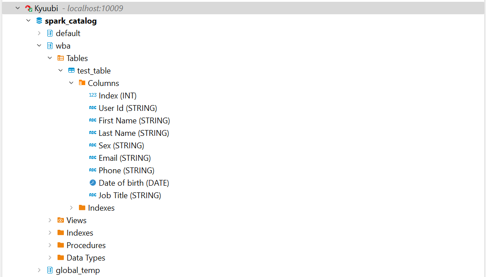

# What is this ?

It's a minimal setup for a cloud agnostic Data Lakehouse Architecture based on Apache Spark & Apache Hive + Postgres DB as Spark Metastore, MinIO as Storage Layer, Delta Lake as Storage Format, Apache Kyuubi as Serverless Spark SQL Gateway.
This  is to be used as a sandbox for running trying things on Spark or purely for didactic purposes.

## Architecture

The architecture of our Lakehouse sandbox is designed to replicate the essential components of a real-world Data Lakehouse, while being flexible and cloud-agnostic.


The main architectural elements and their corresponding technologies are as follows:

* <b>Storage</b>: We use MinIO, a high-performance, Kubernetes-native object storage solution. It's ideal for cloud-agnostic architectures due to its scalability and compatibility with Amazon S3 APIs, which will allow Spark & Hive to interact with it through Hadoop AWS.
* <b>Data Format</b>: Delta Lake, an open-source storage layer, provides ACID transactions, scalable metadata handling, and unifies streaming and batch data processing.
* <b>Data Processing Engine</b>: Apache Spark, a unified analytics engine, is used for large-scale data processing. It provides comprehensive APIs for efficient data handling and analysis.
* <b>Data Catalog</b>: Spark Catalog, integrated within Apache Spark, manages metadata of data and computations, facilitating data discovery and management.
* <b>Metastore</b>: Apache Hive, backed by PostgreSQL, serves as the Spark Metastore. It stores metadata for Spark SQL and enables more complex data operations and optimizations.
* <b>SQL Gateway</b>: Apache Kyuubi acts as a SQL gateway, enabling external applications to interact with the Spark Catalog through JDBC/ODBC interfaces.

## Versions

### Docker Images

| Image         | Version                      |
| ------------- | ---------------------------- |
| minio         | RELEASE.2024-01-13T07-53-03Z |
| minio/mc      | RELEASE.2024-01-13T08-44-48Z |
| postgres      | 10-alpine                    |
| apache/hive   | 3.1.3                        |
| bitnami/spark | 3.4.2                        |
| apache/kyuubi | 1.8.0-spark                  |

### Libraries on Containers

| Dependencies  | MinIO       | Hive        | Spark                 | Kyuubi                |
| ------------- | ----------- | ----------- | --------------------- | --------------------- |
| Hadoop Common | -           | 3.1.0       | 3.3.6                 | 3.3.6                 |
| Hadoop AWS    | -           | 3.1.0       | 3.3.6                 | 3.3.6                 |
| AWS SDK Bundle| -           | 1.11.271    | 1.12.367              | 1.12.367              |
| Delta Lake    | -           | -           | delta-core_2.12:2.4.0 | delta-core_2.12:2.4.0 |
| Apache Spark  | -           | -           | 3.4.1                 | 3.4.1                |

## How to run ?

### Pre-requisites

* Create folder hadoop-libs in the project root
* Download [AWS Java SDK Bundle 1.11.271](https://medium.com/r/?url=https%3A%2F%2Frepo1.maven.org%2Fmaven2%2Fcom%2Famazonaws%2Faws-java-sdk-bundle%2F1.11.271%2Faws-java-sdk-bundle-1.11.271.jar) and [Hadoop AWS 3.1.0](https://medium.com/r/?url=https%3A%2F%2Frepo1.maven.org%2Fmaven2%2Forg%2Fapache%2Fhadoop%2Fhadoop-aws%2F3.1.0%2Fhadoop-aws-3.1.0.jar)
* Place jars in hadoop-libs folder

Use Docker Compose:

```bash
docker compose up
```

## How to shut down and clean-up ?

Use Docker Compose:

```bash
docker compose down -v
```

## Run sample python app on Spark Cluster

There is a sample python app that reads a CSV file from MinIO and creates a Delta Lake from it.

### Pre-requisites

* Access [MinIO UI](http://localhost:9001/) and login `login: accesskey` `password: secretkey`.
  
* Under `wba` bucket create `test-data` path
  
  
* Upload `./test-data/people-100.csv` to new path
   

### Run

```bash
docker compose exec spark-master bash
spark-submit /opt/spark-apps/csv_to_delta.py
```

### Check Results using DBeaver

* Setup an Apache Kyuubi connection
  
* Initial connection after sandbox started can take 1-3 min on average
* We can see the `wba` db created from Spark app and the `test_table` in Delta format, along with it's metadata.
  
* We could also issue SQL statements directly from DBeaver
  